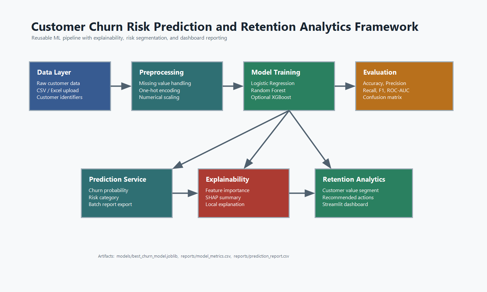

# Customer Churn Risk Scoring System

## Project Overview

**An Intelligent Machine Learning Framework for Customer Churn Risk Prediction and Retention Analytics** is a practical, explainable ML system for identifying customers who are likely to churn and translating those predictions into retention actions.

The project combines supervised churn modeling, reusable preprocessing, risk segmentation, explainability, batch scoring, and a Streamlit analytics dashboard. It is designed for publication demos, portfolio review, and business-facing presentations without making unrealistic claims about automation or decision authority.

## Business Problem

Customer churn reduces recurring revenue and increases acquisition pressure. A useful churn system should not only predict risk, but also help teams understand why a customer is at risk and what retention action is appropriate.

This framework supports:

- customer-level churn probability scoring
- Low, Medium, and High risk segmentation
- model comparison across Logistic Regression, Random Forest, and optional XGBoost
- feature importance and SHAP explainability
- batch report generation for retention teams
- business-friendly intervention recommendations

## Scope and Limitations

This project is a **domain-specific churn analytics framework**, not a universal predictor for every possible dataset.

What it does well:

- demonstrates a complete ML workflow on a telecom customer churn dataset
- converts churn probabilities into business risk segments
- explains model behavior using feature importance and SHAP
- generates retention recommendations and downloadable reports
- provides a professional dashboard for demo and publication

What it does not claim:

- it does not guarantee correct predictions for unrelated datasets
- it does not infer ground truth when the actual churn label is missing
- it does not prove that SHAP drivers are real-world causes
- it does not replace business judgment or customer research

For a dataset with different columns, the model must be retrained using that dataset before predictions can be considered meaningful.

## Labeled and Unlabeled Data Workflow

The system supports two practical usage modes:

| Dataset Type | Contains `Churn Value`? | Purpose | Available Output |
| --- | --- | --- | --- |
| Labeled historical dataset | Yes | Train and validate the model | Accuracy, precision, recall, F1-score, ROC-AUC, risk scores, explanations |
| Unlabeled current customer dataset | No | Score active customers for retention action | Churn probability, risk category, recommendations, prediction report |

When a file does not contain `Churn Value`, the dashboard enters prediction-only mode. In that case, ground-truth metrics are not available because actual churn outcomes are unknown. The recommended business process is:

1. Train the model on labeled historical churn data.
2. Score current unlabeled customers.
3. Run retention campaigns using the risk segments and recommendations.
4. Collect actual churn outcomes after the observation period.
5. Compare predicted risk with actual outcomes and retrain or recalibrate the model.

SHAP values are used for model explanation. They show which features influenced the model's output, but they should not be interpreted as proof that a feature caused churn.

## Architecture



```text
Customer_churn_prediction/
|-- data/
|   `-- raw/
|       `-- dataset2_v2.xlsx
|-- dashboard/
|   `-- app.py
|-- models/
|   |-- best_churn_model.joblib
|   `-- legacy_pipeline.joblib
|-- notebooks/
|-- reports/
|   |-- model_metrics.csv
|   |-- feature_importance.csv
|   |-- confusion_matrix.csv
|   |-- prediction_report.csv
|   `-- book_chapter_documentation.md
|-- src/
|   |-- preprocessing.py
|   |-- train.py
|   |-- predict.py
|   |-- explainability.py
|   |-- recommendation_engine.py
|   |-- score.py
|   `-- utils.py
|-- app.py
|-- train_model.py
|-- requirements.txt
`-- README.md
```

## Machine Learning Workflow

1. Load customer data from `data/raw/dataset2_v2.xlsx`.
2. Normalize numeric fields such as total charges and monthly charges.
3. Build a reusable preprocessing pipeline with median imputation, most-frequent categorical imputation, one-hot encoding, and numerical scaling.
4. Train Logistic Regression, Random Forest, and XGBoost when installed.
5. Use stratified train-test split and 5-fold cross-validation.
6. Tune practical hyperparameters with `GridSearchCV`.
7. Evaluate accuracy, precision, recall, F1-score, ROC-AUC, and confusion matrix.
8. Save the best model artifact with metadata using `joblib`.
9. Score customers, segment risk, and generate retention recommendations.
10. Explain churn drivers with feature importance and SHAP.

## Risk Segmentation

| Churn Probability | Risk Category |
| --- | --- |
| `< 40%` | Low Risk |
| `40% - 69.9%` | Medium Risk |
| `>= 70%` | High Risk |

Thresholds are configurable in `src/utils.py`.

## Retention Recommendation Logic

| Segment | Recommended Action |
| --- | --- |
| High-risk, high-value customer | Offer premium retention package with priority support and loyalty benefits. |
| High-risk customer | Trigger retention call, diagnose dissatisfaction, and offer targeted plan adjustment. |
| Medium-risk customer | Send discount, engagement campaign, or service usage education. |
| Low-risk customer | Continue monitoring through regular lifecycle communication. |

## Dashboard Features

- KPI cards for scored customers, high-risk count, medium-risk count, and average churn probability
- labeled vs unlabeled workflow explanation
- ground-truth metrics when actual `Churn Value` is available
- prediction-only mode when actual churn outcomes are unavailable
- risk distribution and probability spread charts
- high-risk customer queue
- individual customer prediction view
- retention recommendation output
- feature importance visualization
- SHAP summary plot generation
- CSV and Excel upload
- downloadable prediction report

## Installation

Recommended local setup uses the existing Python 3.11 virtual environment:

```powershell
.\venv\Scripts\Activate.ps1
python -m pip install --upgrade pip
pip install -r requirements.txt
```

If PowerShell blocks activation, run:

```powershell
Set-ExecutionPolicy -Scope Process -ExecutionPolicy Bypass
.\venv\Scripts\Activate.ps1
```

If the existing virtual environment was created on another machine or Python path, recreate it:

```powershell
py -3.11 -m venv venv
.\venv\Scripts\Activate.ps1
pip install -r requirements.txt
```

Generic install command:

```bash
pip install -r requirements.txt
```

## Train Models

```bash
python -m src.train
```

Compatibility command:

```bash
python train_model.py
```

## Batch Score Customers

```bash
python -m src.score
```

The scored output is saved to `reports/churn_scored_customers.csv`, and the retention-ready report is saved to `reports/prediction_report.csv`.

## Run Dashboard

```bash
streamlit run dashboard/app.py
```

Compatibility command:

```bash
streamlit run app.py
```

## Technologies Used

- Python
- Pandas and NumPy
- scikit-learn
- XGBoost, optional model candidate
- SHAP
- Plotly
- Matplotlib and Seaborn
- Streamlit
- Joblib

## Screenshots

Add screenshots after running the dashboard:

- Dashboard KPI overview
- Risk distribution charts
- Feature importance panel
- SHAP summary plot
- Individual prediction and recommendation output

## Results Artifacts

Training generates:

- `reports/model_metrics.csv`
- `reports/confusion_matrix.csv`
- `reports/test_predictions.csv`
- `reports/feature_importance.csv`
- `models/best_churn_model.joblib`

## Future Enhancements

- add model calibration and threshold optimization by retention budget
- integrate experiment tracking with MLflow
- add fairness and subgroup performance checks
- create PDF executive reports
- connect batch scoring to a CRM export workflow
- add automated data validation before scoring
